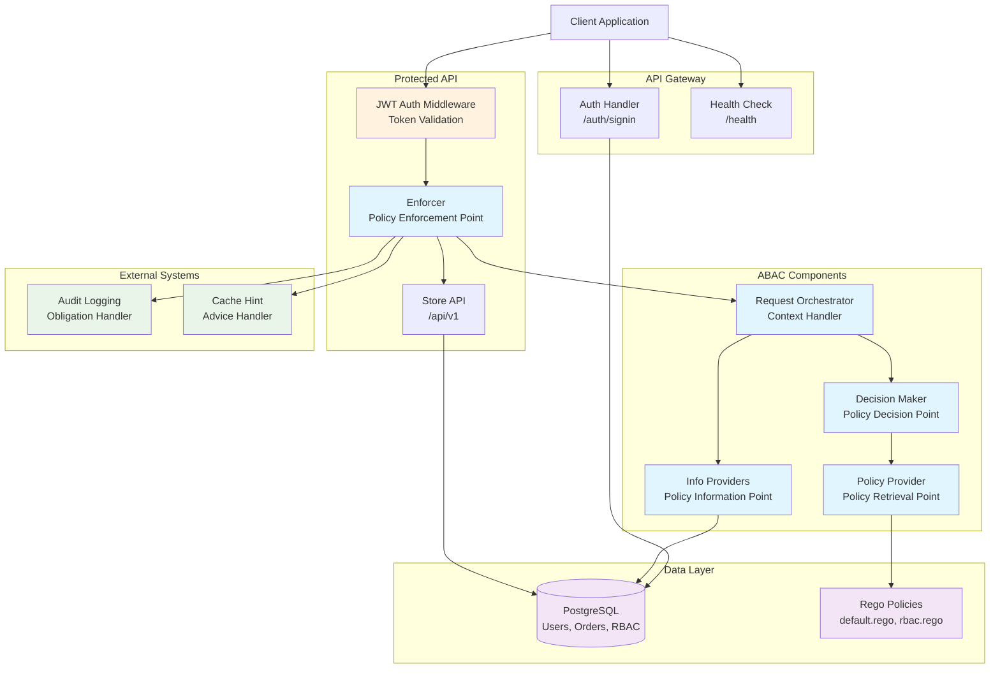

# E-Commerce Store API

[](https://github.com/CameronXie/access-control-explorer/actions/workflows/test.yaml)

## Overview

The E-Commerce Store API demonstrates a comprehensive implementation of Attribute-Based Access Control (ABAC) for
authorisation in a REST API context, with support for Role-Based Access Control (RBAC) patterns. This example showcases
how ABAC can provide flexible and fine-grained access control while maintaining the familiar concepts of roles and
permissions.

The implementation uses PostgreSQL for RBAC information storage with support for hierarchical role structures, OPA/Rego
for policy evaluation, and JWT-based authentication with automatic user context enrichment. This example is designed
for demonstration and educational purposes, featuring simplified authentication mechanisms that are not recommended for
production use.

## Architecture




## Key Features

- **XACML-Style Architecture**: Implementation follows XACML patterns with clear separation of Policy Enforcement
  Point (PEP), Policy Decision Point (PDP), Policy Retrieval Point (PRP), and Context Handler
- **ABAC with RBAC Support**: Flexible attribute-based access control that naturally supports role-based patterns
  through policy configuration
- **Role Hierarchy**: PostgreSQL-backed role hierarchy supporting inheritance and complex organisational structures
- **OPA Integration**: Policy evaluation using Open Policy Agent with Rego policy language
- **JWT Authentication**: RS256-signed JWT tokens for stateless authentication with automatic user context enrichment
- **Middleware Chain**: JWT authentication middleware validates tokens and enriches request context before ABAC
  enforcement
- **Automatic Ownership**: Orders automatically inherit ownership from an authenticated user context
- **Obligations and Advices**: Support for policy-driven actions (audit logging) and hints (caching)
- **Comprehensive Logging**: Structured logging for operational observability and audit trails

## API Endpoints

### Authentication

#### POST /auth/signin

Simplified authentication endpoint for demonstration purposes.

**⚠️ Warning**: This endpoint is for demo purposes only and lacks critical security features such as password
verification, rate limiting, and multifactor authentication. Do not use in production environments.

**Request**:

```json
{
  "email": "alice@abac.com"
}
```

**Response**:

```json
{
  "token": "<JWT_TOKEN>",
  "token_type": "Bearer"
}
```

### Order Management

#### POST /api/v1/orders

Create a new order. Requires valid JWT authentication and appropriate permissions. The order automatically inherits
ownership from the authenticated user and is initialised with the "created" status.

**Request**:

```json
{
  "name": "order-123",
  "attributes": {
    "priority": "high",
    "total_amount": "299.99"
  }
}
```

**Response**:

```json
{
  "id": "123e4567-e89b-12d3-a456-426614174000",
  "name": "order-123",
  "attributes": {
    "owner": "<USER_ID>",
    "status": "created",
    "priority": "high",
    "total_amount": "299.99"
  }
}
```

#### GET /api/v1/orders/{id}

Retrieve an order by ID. Requires valid JWT authentication and appropriate permissions.

**Response**:

```json
{
  "id": "123e4567-e89b-12d3-a456-426614174000",
  "name": "order-123",
  "attributes": {
    "owner": "<USER_ID>",
    "status": "created",
    "priority": "high",
    "total_amount": "299.99"
  }
}
```

### Health Check

#### GET /health

Service health check endpoint.

**Response**:

```json
{
  "status": "healthy"
}
```

## Development Setup

### Prerequisites

- Docker and Docker Compose
- Make

### Environment Configuration

The application requires several environment variables for operation:

- `POSTGRES_*`: Database connection parameters
- `PRIVATE_KEY_BASE64`: Base64-encoded RSA private key for JWT signing
- `PUBLIC_KEY_BASE64`: Base64-encoded RSA public key for JWT verification
- `JWT_ISSUER`: JWT token issuer identifier
- `JWT_AUDIENCE`: JWT token audience identifier
- `PORT`: HTTP server port (optional, defaults to 8080)

### Local Development Environment

Navigate to the project root and set up the development environment:

```shell
make up
```

This command:

- Generates RSA key pairs for JWT operations if not present
- Creates `.env` file from `.env.example` with generated keys
- Starts all required services via Docker Compose including PostgreSQL

### Database Setup

Initialise the database schema and seed data:

```shell
# From within the Docker development container
make migrate-db 
make seed-db
```

These commands create:

- Role hierarchy (admin → customer_service → customer)
- Sample users with different role assignments
- Permission structures for order operations
- Demonstration orders with ownership attributes

## Building and Running

### Build the Application

```shell
# From examples/abac directory
make build
```

Build artifacts are placed in `_dist/build/`:

- `api`: Compiled application binary
- `policies/`: Rego policy files copied for runtime

### Run the Application

```shell
# Run with default configuration ./_dist/build/api
# Run with custom port
PORT=9090 ./_dist/build/api
```

The application logs its version and listening address on startup.

## API Usage Examples

### Authentication Flow

```shell
curl -X POST http://localhost:8080/auth/signin
-H "Content-Type: application/json"
-d '{"email":"alice@abac.com"}'

# Response includes token for subsequent requests
# {
# "token": "ey...",
# "token_type": "Bearer"
# }
```

### Order Operations

```shell
# Create new order
curl -X POST http://localhost:8080/api/v1/orders
-H "Authorization: Bearer <JWT_TOKEN>"
-H "Content-Type: application/json"
-d '{ "name": "laptop-order-001", "attributes": { "priority": "high", "category": "electronics" } }'

# Retrieve order by ID
curl -X GET http://localhost:8080/api/v1/orders/<ORDER_ID>
-H "Authorization: Bearer <JWT_TOKEN>"
```

### Health Check

```shell
curl -X GET http://localhost:8080/health
```

## Testing

### Unit Testing

Run the complete test suite:

```shell
make test
```

Run Go-specific tests with coverage:

```shell
make test-go
```

Test artifacts including coverage reports are generated in `_dist/tests/`.

## Policy Configuration

The application uses two main Rego policy files:

- `policies/default.rego`: Top-level policy combiner that merges subject and resource evaluation results
- `policies/rbac.rego`: Role-based access control implementation within ABAC framework

Policy decisions trigger:

- **Obligations**: `audit_logging` for access event logging
- **Advices**: `cache_hint` for client caching guidance via `X-ABAC-Decision-TTL` header

## Troubleshooting

### Common Issues

**401 Unauthorized**: Verify JWT token validity and ensure proper Authorization header format
**403 Forbidden**: Check user roles and permissions in the database; verify policy evaluation
**500 Internal Server Error**: Review application logs for detailed error information
**Database Connection**: Ensure PostgreSQL is running and environment variables are correctly configured

### Debug Information

- Application logs provide structured output with request correlation IDs
- Policy decisions are logged with evaluation context
- Database queries include performance metrics
- JWT validation errors are logged with specific failure reasons

## Security Considerations

This example demonstrates ABAC implementation patterns but includes several simplifications for educational purposes:

- **Authentication**: The signin endpoint lacks password verification, rate limiting, and account lockout protection
- **JWT Security**: Token rotation and revocation mechanisms are not implemented
- **Input Validation**: Production deployments should include comprehensive input sanitisation
- **Error Handling**: Internal error details are intentionally not exposed to clients
- **Audit Logging**: Production systems should implement comprehensive audit trails with tamper protection
